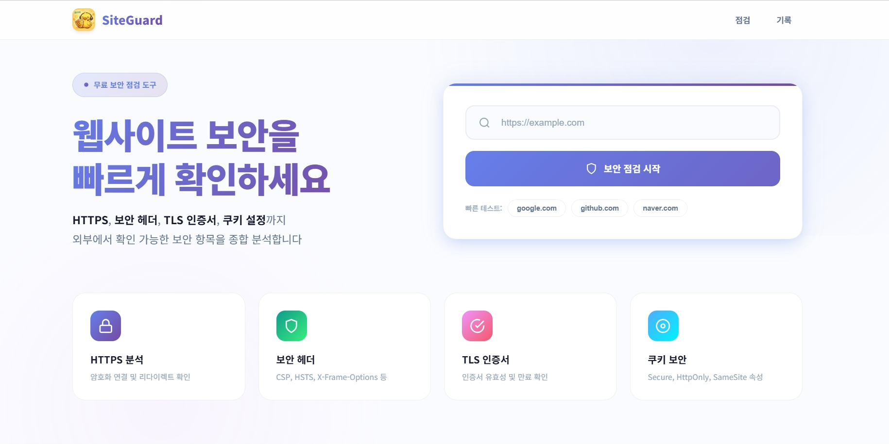
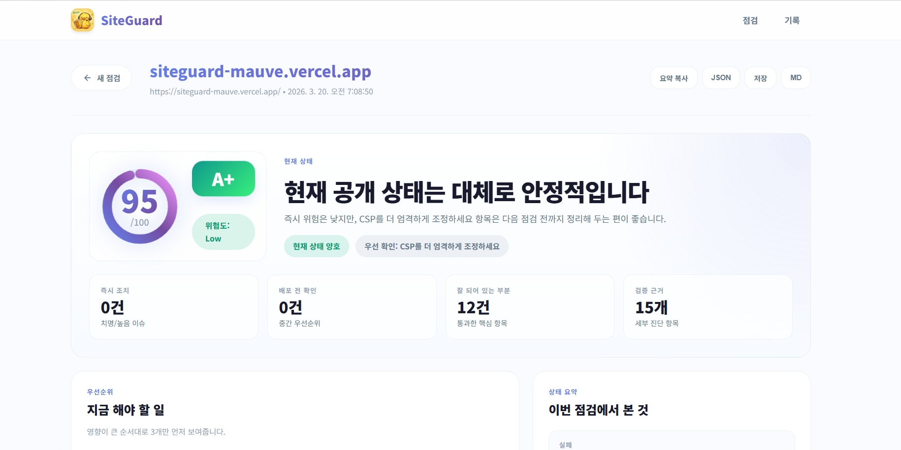
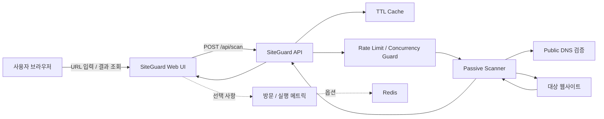

# SiteGuard

<p align="center">
  
</p>

<p align="center">
  공개 URL 기준으로 웹사이트의 기본 보안 상태를 빠르게 점검하는 패시브 스캐너
</p>

<p align="center">
  <a href="./README.en.md">English README</a>
</p>

<p align="center">
  <a href="https://siteguard-mauve.vercel.app/">Demo</a>
</p>

## 소개

SiteGuard는 공개된 `http://` 또는 `https://` URL을 기준으로, 외부에서 확인 가능한 기본 보안 상태를 빠르게 점검하는 도구입니다.

이 프로젝트는 침투 테스트 도구가 아니라, 배포 전이나 운영 중에 한 번쯤 점검해야 할 **기본 보안 구성**을 빠르게 읽어주는 1차 점검 도구에 가깝습니다.

예를 들면 이런 질문에 답하는 데 적합합니다.

- HTTPS는 제대로 지원되는가?
- HTTP 진입점은 HTTPS로 강제되는가?
- TLS 인증서는 정상인가?
- CSP, HSTS, Referrer-Policy 같은 보안 헤더가 빠져 있지는 않은가?
- 쿠키에 `Secure`, `HttpOnly`, `SameSite` 같은 속성이 적절히 붙어 있는가?
- 공개 페이지에 mixed content 같은 직접적인 브라우저 위험 신호가 보이는가?

## 스크린샷

### 메인 화면



URL을 입력해 바로 공개 보안 상태를 점검할 수 있는 시작 화면입니다.

### 결과 화면



점수, 현재 상태, 우선순위, 문제 목록, 세부 진단까지 한 화면에서 확인할 수 있습니다.

## 이 프로젝트가 다루는 범위

SiteGuard는 **공개 URL 기준의 패시브 외부 점검**에 집중합니다.

즉, 다음과 같은 항목은 잘 봅니다.

- HTTPS 지원 여부
- HTTP -> HTTPS 리다이렉트
- TLS 인증서 유효성 및 만료일
- `Strict-Transport-Security`
- `Content-Security-Policy`
- 클릭재킹 방어 (`X-Frame-Options`, `frame-ancestors`)
- `X-Content-Type-Options: nosniff`
- `Referrer-Policy`
- `Permissions-Policy`
- 쿠키 보안 속성 (`Secure`, `HttpOnly`, `SameSite`)
- 응답에서 보이는 CORS 설정
- 기술 스택 노출 헤더
- mixed content 신호
- 로그인 폼 전송 안전성 힌트
- `security.txt`

반대로, 아래 범위는 의도적으로 다루지 않습니다.

- 로그인 이후 기능 점검
- SQL Injection, Stored XSS, IDOR 같은 적극적 취약점 검증
- 인증/인가 우회 테스트
- 비즈니스 로직 취약점 분석
- 내부망, 사설 IP, `localhost` 대상 점검

즉 SiteGuard는 **모든 보안 문제를 진단하는 도구**가 아니라, **밖에서 바로 보이는 기본 보안 상태를 빠르게 확인하는 도구**입니다.

## 핵심 기능

- 공개 URL 하나로 빠르게 실행하는 패시브 보안 점검
- 증거 기반 결과 화면
- 문제 요약, 우선순위, 권장 조치 제공
- `direct / hardening / maturity` 기준의 위험 분류
- 최근 점검 기록 저장
- 선택적으로 사용할 수 있는 관리자용 `/admin` 대시보드
- Redis 기반 방문자 수 / 실행 수 집계 지원
- Vercel, Render, Docker, 일반 Node.js 환경 배포 지원

## 아키텍처

아래 구조는 SiteGuard의 핵심 흐름만 단순하게 정리한 것입니다.



핵심만 보면 다음과 같습니다.

- 사용자는 Web UI에서 URL을 입력합니다.
- API는 캐시, 레이트리밋, 동시 실행 제한을 먼저 거칩니다.
- 스캐너는 공개 대상만 점검하도록 DNS와 네트워크 안전장치를 적용합니다.
- 결과는 요약, 근거, 권장 조치 형태로 다시 UI에 전달됩니다.
- 방문 수와 실행 수 집계는 선택적으로 Redis에 저장할 수 있습니다.

## 리스크 모델 특징

SiteGuard는 모든 문제를 같은 온도로 다루지 않도록 설계되어 있습니다.

- `direct`: 실제 브라우저나 사용자에게 직접적인 위험으로 이어질 수 있는 항목
- `hardening`: 방어선을 더 강화하기 위해 필요한 항목
- `maturity`: 운영 성숙도와 신뢰도에 가까운 항목

이 구분 덕분에:

- 만료된 TLS 인증서나 mixed content 같은 직접 위험은 강하게 반영하고
- CSP, HSTS 같은 하드닝 항목은 과도하게 벌점하지 않으며
- `security.txt` 같은 운영 신호는 낮은 우선순위로 다룰 수 있습니다.

## 빠른 시작

### 요구 사항

- Node.js 20+
- npm

### 설치

```bash
npm install
```

### 개발 실행

```bash
npm run build
npm run dev
```

브라우저에서 아래 주소를 열면 됩니다.

```text
http://localhost:3000
```

### 프로덕션 방식 실행

```bash
npm start
```

## 사용 가능한 스크립트

| 스크립트 | 설명 |
| --- | --- |
| `npm run dev` | 로컬 서버 실행 (`node --watch`) |
| `npm run build` | Tailwind CSS 빌드 |
| `npm run build:css` | CSS 한 번만 빌드 |
| `npm run dev:css` | CSS 변경 감시 |
| `npm test` | 테스트 실행 |
| `npm start` | 프로덕션 서버 실행 |

## API 엔드포인트

| Method | Path | 설명 |
| --- | --- | --- |
| `GET` | `/api/health` | 서버 상태 확인 |
| `GET` | `/api/ready` | readiness 확인 |
| `POST` | `/api/scan` | 보안 점검 실행 |
| `POST` | `/api/metrics/visit` | 방문 집계 기록 |
| `POST` | `/api/admin/login` | 관리자 로그인 |
| `POST` | `/api/admin/logout` | 관리자 로그아웃 |
| `GET` | `/api/admin/session` | 관리자 세션 상태 확인 |
| `GET` | `/api/admin/metrics` | 관리자 통계 조회 |

예시 요청:

```bash
curl -X POST http://localhost:3000/api/scan \
  -H "Content-Type: application/json" \
  -d '{"url":"https://example.com"}'
```

## 환경 변수

### 기본 서버 / 스캐너 설정

| 변수명 | 설명 | 기본값 |
| --- | --- | --- |
| `PORT` | 서버 포트 | `3000` |
| `SCAN_CACHE_TTL_MS` | 점검 결과 캐시 유지 시간 | `300000` |
| `SCAN_CACHE_MAX_ENTRIES` | 캐시 최대 엔트리 수 | `300` |
| `RATE_LIMIT_WINDOW_MS` | 레이트리밋 윈도우 | `60000` |
| `RATE_LIMIT_MAX` | IP 기준 윈도우당 최대 점검 요청 수 | `10` |
| `MAX_CONCURRENT_SCANS` | 동시에 실행 가능한 점검 수 | `4` |

### 관리자 대시보드

| 변수명 | 설명 | 기본값 |
| --- | --- | --- |
| `ADMIN_USERNAME` | 관리자 로그인 아이디 | 없음 |
| `ADMIN_PASSWORD_HASH` | 권장 관리자 비밀번호 해시 | 없음 |
| `ADMIN_PASSWORD` | 평문 비밀번호 대체값 | 없음 |
| `ADMIN_SESSION_SECRET` | 관리자 세션 서명용 비밀키 | 없음 |
| `ADMIN_SESSION_TTL_SEC` | 관리자 세션 유지 시간(초) | `1209600` |

`ADMIN_PASSWORD_HASH` 사용을 권장합니다.

비밀번호 해시 생성:

```bash
node --input-type=module -e "import { createPasswordHash } from './src/admin-auth.js'; console.log(createPasswordHash('YOUR_PASSWORD'))"
```

세션 시크릿 생성:

```bash
node -e "console.log(require('crypto').randomBytes(32).toString('hex'))"
```

### 통계 / 메트릭 설정

| 변수명 | 설명 | 기본값 |
| --- | --- | --- |
| `SITEGUARD_METRICS_TIMEZONE` | 일별 집계 타임존 | `Asia/Seoul` |
| `SITEGUARD_METRICS_TTL_SEC` | 일별 메트릭 키 TTL | `10368000` |
| `SITEGUARD_RECENT_SCAN_LIMIT` | 최근 점검 로그 보관 수 | `20` |
| `SITEGUARD_TOP_DOMAIN_LIMIT` | 상위 도메인 집계 수 | `5` |
| `UPSTASH_REDIS_REST_URL` | Upstash Redis REST URL | 없음 |
| `UPSTASH_REDIS_REST_TOKEN` | Upstash Redis REST 토큰 | 없음 |
| `KV_REST_API_URL` | Vercel KV 호환 URL fallback | 없음 |
| `KV_REST_API_TOKEN` | Vercel KV 호환 토큰 fallback | 없음 |

Redis가 설정되지 않으면 메트릭은 메모리 기반으로 동작합니다.

- 로컬 개발에는 충분합니다.
- 서버리스 환경에서는 누적 통계가 정확하지 않을 수 있습니다.
- 운영 환경에서는 Redis 사용을 권장합니다.

## 선택 기능: 관리자 대시보드

SiteGuard는 `/admin`에서 관리자 전용 통계를 제공합니다.

확인 가능한 항목:

- 누적 방문자 수
- 페이지뷰
- 점검 실행 수
- 성공 / 실패 / 캐시 비율
- 최근 7일 흐름
- 많이 점검된 도메인
- 최근 실행 로그

운영 환경에서 안정적으로 사용하려면 아래 순서를 권장합니다.

1. 관리자 인증 환경 변수 설정
2. Redis 연결
3. 재배포

Vercel에서는 Storage / Marketplace에서 Upstash Redis를 연결하는 방식이 가장 간단합니다.

## 배포

### Vercel

이 저장소는 `vercel.json`과 `api/` 서버리스 엔드포인트를 포함하고 있습니다.

권장 설정:

- Framework Preset: `Other`
- Build Command: `npm run build`
- Output Directory: `public`

관리자 통계를 운영에 사용할 경우, 관리자 인증 변수와 Redis 연결을 함께 설정하는 편이 좋습니다.

### Render

`render.yaml` 예시가 포함되어 있습니다.

### Docker

```bash
docker build -t siteguard .
docker run -p 3000:3000 siteguard
```

## 프로젝트 구조

```text
.
├─ api/                  # Vercel 서버리스 엔드포인트
├─ public/               # 사용자 UI 및 관리자 대시보드 정적 파일
├─ src/                  # 스캐너, 인증, 메트릭, 런타임 로직
├─ test/                 # 테스트 코드
├─ server.js             # 로컬 Node.js 서버 엔트리포인트
├─ vercel.json           # Vercel 설정
├─ render.yaml           # Render 배포 예시
├─ Dockerfile            # Docker 이미지 빌드 파일
└─ package.json
```

## 런타임 안전장치

SiteGuard는 외부 URL에 요청을 보내는 도구이기 때문에, 기본적인 안전장치를 함께 갖추고 있습니다.

- `localhost`, 사설 IP, 내부 대상 차단
- DNS 검증 및 rebinding 완화
- 검증된 주소에 대한 pinned lookup
- 실제 연결된 소켓 주소 검증
- 절대 타임아웃
- 응답 바디 크기 제한
- IP 기준 레이트리밋
- 동시 실행 수 제한
- TTL 캐시

이 장치들은 SiteGuard를 더 안전하게 운영하기 위한 것이며, 완전한 보안 경계 자체를 대체하지는 않습니다.

## 테스트

```bash
npm test
```

CSS 빌드 확인:

```bash
npm run build
```

## 책임 있는 사용

권한이 있는 대상만 점검하세요.

SiteGuard는 패시브 스캐너이지만, 여전히 법률, 서비스 약관, 조직 정책을 준수하면서 사용해야 합니다.

## 보안 제보

SiteGuard 자체의 취약점을 발견했다면 공개 이슈 대신 [SECURITY.md](./SECURITY.md)를 먼저 확인해 주세요.

## 기여

기여 기준, 개발 환경, PR 체크리스트는 [CONTRIBUTING.md](./CONTRIBUTING.md)에 정리해두었습니다.

## 더 읽기

- 개발기: [SiteGuard 개발기: URL 하나로 웹사이트 보안을 점검하는 도구를 만들며 배운 것](https://velog.io/@lova-clover/SiteGuard-%EA%B0%9C%EB%B0%9C%EA%B8%B0-URL-%ED%95%98%EB%82%98%EB%A1%9C-%EC%9B%B9%EC%82%AC%EC%9D%B4%ED%8A%B8-%EB%B3%B4%EC%95%88%EC%9D%84-%EC%A0%90%EA%B2%80%ED%95%98%EB%8A%94-%EB%8F%84%EA%B5%AC%EB%A5%BC-%EB%A7%8C%EB%93%A4%EB%A9%B0-%EB%B0%B0%EC%9A%B4-%EA%B2%83)

## 라이선스

이 프로젝트는 [MIT License](./LICENSE)를 따릅니다.
